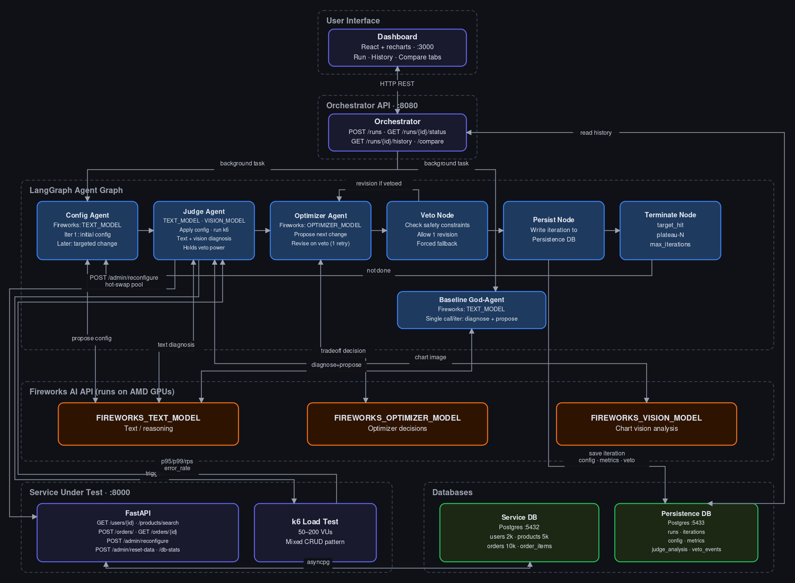

# TuneFlow — Autonomous Backend Performance Optimization

A self-tuning backend system that automatically benchmarks, diagnoses, and optimizes a running service using a multi-agent AI loop — validated against real k6 load tests, with a live React dashboard and head-to-head comparison against a single-agent baseline.

---

## What it does

Backend performance tuning is still largely manual: an engineer changes a connection pool size or a cache TTL, reruns a load test, eyeballs the numbers, and repeats — by hand, with no record of what was tried or why. TuneFlow automates that whole loop.

Point it at a service and it:
1. Applies a candidate configuration to the live service via a hot-swap endpoint
2. Hammers it with a real k6 load test (100 VUs, configurable)
3. Diagnoses what's actually limiting performance (pool exhaustion, slow queries, timeouts)
4. Proposes a targeted configuration change
5. Validates whether the change helped — all against real metrics, never simulated numbers
6. Repeats until a latency target is hit, performance plateaus, or max iterations is reached

The loop is implemented as three specialized agents (**Config Agent**, **Judge Agent**, **Optimizer Agent**) coordinating through LangGraph, with the Judge holding veto power over any proposal that violates a safety constraint. A single-agent **baseline mode** runs the identical workload through one model call per iteration, so the dashboard's side-by-side comparison gives a measured answer to "does the extra structure actually help" — not a claim, a number.

---

## Stack

| Layer | Tech |
|---|---|
| Service under test | FastAPI + PostgreSQL (asyncpg, SQLAlchemy async) |
| Load testing | k6 (100–200 VUs, mixed CRUD) |
| Agent framework | LangGraph (Config → Judge → Optimizer → Veto → Persist → Terminate) |
| LLM inference | Fireworks AI (DeepSeek V4 Flash) |
| Persistence | PostgreSQL (separate DB from service) |
| Orchestrator | FastAPI + background tasks |
| Dashboard | React + Recharts (live polling, 3 tabs) |
| Infrastructure | Docker Compose (5 services) |

---

## Architecture



> Interactive source: [`docs/architecture.excalidraw`](docs/architecture.excalidraw) — open in [excalidraw.com](https://excalidraw.com) for a zoomable, annotated view.
> Text/CI source: [`docs/architecture.mmd`](docs/architecture.mmd) (Mermaid flowchart).
> Regenerate PNG from Mermaid: `npx @mermaid-js/mermaid-cli -i docs/architecture.mmd -o docs/architecture.png -b "#0f1117" -w 1400 -H 900`

### Key design decisions

**Hot-swap instead of restart.** `service/database.py`'s `hot_swap_pool()` builds a new SQLAlchemy async engine with the new settings, drains in-flight queries, disposes the old engine, and atomically swaps a module-level pointer — the process never stops accepting requests. This ensures the load test measures configuration quality, not boot time.

**Separate persistence database.** Run history lives in a completely separate Postgres container from the service's own database. If they shared a database, every config change and load-test write would contend for the exact connections being measured, contaminating the experiment.

**Code-enforced veto round limit.** The veto node allows exactly one revision attempt, enforced in code — not by prompting the model to "stop after one try." This prevents a stuck negotiation from eating the iteration budget.

**Disagreement-based abstention.** Alongside its decomposed step-by-step diagnosis, the Judge makes a second *direct* single-shot diagnosis of the same metrics (concurrently — no added latency). If the two disagree on the bottleneck, the belief is treated as fragile and the iteration abstains: the current config is kept rather than applying an uncertain change. This adapts the cross-regime disagreement signal from ["Decomposed Prompting Does Not Fix Knowledge Gaps, But Helps Models Say 'I Don't Know'"](https://arxiv.org/abs/2602.04853) — factual knowledge is stable across prompting regimes while hallucinations are stochastic, so disagreement is a precise, training-free error signal. Toggle with `DBA_ABSTENTION` in `.env`.

**Baseline comparison mode.** A single god-agent baseline runs the identical workload so that the difference between the multi-agent structure and one model doing everything is a measurable number in the Compare tab.

---

## Scope

- **Fixed, controlled load only.** TuneFlow measures *relative configuration performance* at a fixed load (50–200 concurrent VUs). It does not predict or extrapolate to production-scale traffic.
- **No full service restarts.** All changes go through `/admin/reconfigure` (hot-swap). This is by design — it isolates configuration quality from restart overhead.
- **Five tunable parameters.** `pool_size`, `query_timeout_ms`, `cache_ttl_seconds`, `batch_size`, `retry_interval_ms`. The optimization loop and safety constraints are parameter-agnostic.

---

## Explore without Docker

The repo ships sample run outputs so you can browse the full dashboard — convergence charts, per-iteration agent analysis, veto events, and the multi-agent vs. baseline comparison — without spinning up Docker or spending any Fireworks AI credits.

```bash
# 1. Install dashboard deps
cd dashboard && npm install

# 2. Start the dev server (no orchestrator needed)
npm start
```

On first load the History tab shows an "⚡ Explore Demo Run" button that loads `docs/sample_run_output/multi_agent_run.json` directly into the UI. The Compare tab pre-populates with both demo runs so the convergence charts are visible immediately.

The sample runs cover:
- **Multi-agent run** (8 iterations, `target_hit`): four sequential bottlenecks — pool exhaustion → cache-miss spike → query latency → retry storm — each diagnosed and fixed in turn. Includes a veto event in iteration 3.
- **Baseline run** (8 iterations, `plateau`): same starting conditions, god-agent increments pool size incrementally, stalls at 338ms p95 / 82.7 RPS.

---

## Setup

### Prerequisites

- Docker + Docker Compose
- A Fireworks AI API key — [fireworks.ai](https://fireworks.ai)
- Node.js 20+ (dashboard dev only — not needed if using the compose dashboard service)

### Environment

```bash
cp .env.example .env
# Set FIREWORKS_API_KEY=fw_...
```

### Run

```bash
docker-compose up -d        # starts all 5 services
# Dashboard opens at http://localhost:3000
# Orchestrator API at http://localhost:8080
```

Or start a run directly via API:

```bash
# Multi-agent run
curl -X POST http://localhost:8080/runs \
  -H "Content-Type: application/json" \
  -d '{"mode":"multi_agent","max_iterations":15,"vus":100,"load_duration_seconds":30}'

# Baseline run for comparison
curl -X POST http://localhost:8080/runs \
  -H "Content-Type: application/json" \
  -d '{"mode":"baseline","max_iterations":15,"vus":100,"load_duration_seconds":30}'
```

### Tests

```bash
pip install -r tests/requirements.txt
pytest tests/ -v

# With live service:
LIVE_TEST_URL=http://localhost:8000 pytest tests/test_hotswap.py -v
```

---

## Repo structure

```
/service          FastAPI service under test
  main.py         App entry point + lifespan
  config.py       In-memory ServiceConfig + atomic hot-swap
  database.py     Async SQLAlchemy engine + hot_swap_pool()
  cache.py        Thread-safe TTL cache (product search)
  seed.py         Seed 2k users, 5k products, 10k orders
  routers/        users.py, products.py, orders.py, admin.py

/loadtest
  loadtest.js     k6 script (mixed CRUD, 100–200 VUs)
  runner.py       Python wrapper → structured metrics dict

/agents
  fireworks_client.py  Centralized LLM client (text + vision)
  config_agent.py      Config Agent — initial + targeted proposals
  judge_agent.py       Judge Agent — apply, test, diagnose, veto
  optimizer_agent.py   Optimizer Agent — propose, revise
  graph.py             LangGraph multi-agent graph
  baseline.py          Single god-agent baseline loop
  termination.py       Stop logic (target / plateau / max-iter)
  chart.py             Matplotlib chart renderer for vision analysis

/persistence
  models.py       SQLAlchemy Run + Iteration models
  database.py     Async engine for persistence DB
  store.py        Read/write access layer

/orchestrator
  main.py         FastAPI: start run, poll status, history, compare

/dashboard
  src/
    App.jsx                 3 tabs: Run / History / Compare
    api.js                  Orchestrator API client
    sampleData.js           Embedded demo runs (no API needed)
    components/
      RunLauncher.jsx       Launch multi-agent or baseline run
      ConvergenceChart.jsx  p95/p99/RPS across iterations + stat pills
      ComparisonChart.jsx   Side-by-side multi-agent vs baseline
      IterationTable.jsx    Per-iteration table with analysis panels
      StatusBar.jsx         Live run status + progress bar
      RunSelector.jsx       Select two runs for comparison

/infra
  docker/
    Dockerfile.service
    Dockerfile.orchestrator
  alibaba/         Legacy deployment scripts (unused)

/docs
  architecture.md
  architecture.mmd       Mermaid flowchart source
  architecture.excalidraw  Interactive diagram (open in excalidraw.com)
  PROJECT_GUIDE.md       Deep-dive: design decisions, traced iteration, bugs
  demo_script.md         Walkthrough narration for live demos
  sample_run_output/
    multi_agent_run.json   8-iter multi-agent run (target_hit, includes veto)
    baseline_run.json      8-iter baseline run (plateau, for comparison)

/tests
  conftest.py
  test_termination.py   target / plateau / max-iter
  test_veto.py          safety constraints + round-limit
  test_hotswap.py       config swap + cache reset + live endpoint

docker-compose.yml
.env.example
README.md
```

---

## Future direction

This project tunes one service under one fixed workload. The interesting open question is what happens when the environment or traffic pattern changes — a configuration tuned on a 2-core dev machine is wrong on a 32-core staging box, and a read-heavy tuning is wrong when the workload shifts write-heavy. A production version would continuously re-tune as conditions change, and surface recommended changes as pull requests with load-test evidence attached.

---

## License

MIT — see [LICENSE](LICENSE)
